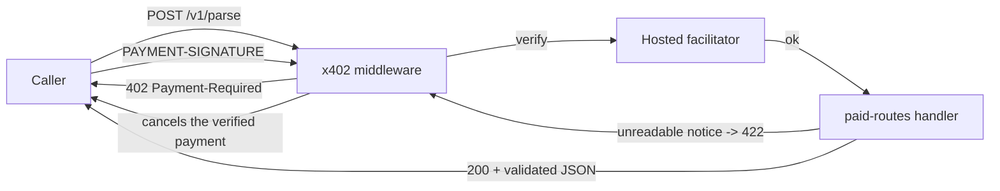

# Meera — Railway Delay Notice API

A pay-per-call HTTP API that turns the messy delay notices Indian Railways
stations post into clean, schema-valid JSON — and **does not charge you when it
fails to read the notice**.

Built for [The Operator's Booth](https://devcon.loopshouse.xyz) · Road to Devcon VI.

```
TRAIN 12137/12138 DEEPAK EXPRESS          →    { "trainNumber": "12137",
STATION: PUNE JN (PUNE)                          "station": { "name": "PUNE JN",
SCHEDULED DEPARTURE: 18:10 28/08/2026            "code": "PUNE" },
EXPECTED DEPARTURE: 19:30 28/08/2026             "expected": { "time": "19:30",
DELAY: 80 MIN                                   "date": "2026-08-28" },
REASON: Waterlogging near Kharagpur             "delayMinutes": 80, … }
```

---

## The one rule

> Nobody pays for a notice she couldn't read.

This is not a slogan bolted on after the fact — it is a consequence of how the
`exact` scheme works, and the repo is arranged so that you can check it:

1. The facilitator **verifies** the payment.
2. **Your handler runs.**
3. Only then does x402 **settle**.

If the handler answers 4xx, x402 raises `onVerifiedPaymentCanceled` and the
verified payment is released. The caller keeps their coin. The alternative —
`extra: { paymentFlow: "upfront" }` — settles *before* the handler and would
charge for work that never happened. Meera does not use it, and
`tests/rubric.test.ts` asserts its absence.

---

## Quick start

Requires **Node 22** (or 20.12+).

```bash
npm install
cp .env.example .env        # then put your own X402_PAY_TO in it
npm start                   # → http://localhost:4021
```

Open <http://localhost:4021> for the demo UI. It loads the sample corpus, runs
the free readability check live, and shows the real 402 handshake — no wallet
required to see how it works.

Free, no credentials beyond `X402_PAY_TO`:

```bash
curl localhost:4021/v1/pricing
curl localhost:4021/v1/samples
curl -X POST localhost:4021/v1/validate \
  -H 'content-type: application/json' \
  -d '{"notice":"TRAIN 12137 DEEPAK EXPRESS, STATION PUNE JN, EXPECTED DEPARTURE 19:30"}'
```

See the 402 a paid route returns:

```bash
curl -i -X POST localhost:4021/v1/parse \
  -H 'content-type: application/json' \
  -d '{"notice":"TRAIN 12137 DEEPAK EXPRESS, STATION PUNE JN, EXPECTED DEPARTURE 19:30"}'
```

### Paying for real

Two different payers are possible. **Neither has been run against a live
facilitator by this repository** — see [Limitations](#limitations).

#### Intended path: a browser wallet (MetaMask)

The intended payer signs in the browser, so **no private key is ever stored,
configured, or logged**. This repository does not ship that browser client yet:
the demo page fetches the paid route and shows the real `402` it gets back,
rather than pretending to pay. The page says so in those words.

To take that path, a browser client has to read the `PAYMENT-REQUIRED` header
and ask MetaMask to sign the `exact` / EIP-3009
`TransferWithAuthorization` typed data for
`0x1c7D4B196Cb0C7B01d743Fbc6116a902379C7238` with domain
`name: "USDC"`, `version: "2"`, `chainId: 11155111`, then retry with the
`PAYMENT-SIGNATURE` header. All of that is server-side-ready today; only the
browser half is missing.

#### Local test path: a throwaway key in a script

`scripts/buy.ts` is a **local testing tool**, not the intended payment path. It
signs with `EVM_PRIVATE_KEY`, so use a throwaway key holding test USDC and
nothing else. Everything else — the server, the free routes, the `402` — works
with that variable left empty.

1. Get test USDC on Ethereum Sepolia. Circle's testnet faucet and the usual
   Sepolia faucets will both do; the token is Circle-issued USDC at
   `0x1c7D4B196Cb0C7B01d743Fbc6116a902379C7238`.
2. Put your **public** receiving address in `.env`, and a test key only if you
   want the script:

   ```ini
   X402_PAY_TO=0xYourReceivingAddress
   # optional, local script only — leave as the zero placeholder otherwise
   EVM_PRIVATE_KEY=0xYourThrowawayTestnetKey
   ```

3. Pay for a call:

   ```bash
   npm run buy -- --sample en-structured-pune     # a readable notice → charged
   npm run buy -- --sample broken-prose           # an unreadable one → not charged
   ```

   The script prints the parsed notice on success. On failure it prints the
   4xx **and the absence of a `payment-response` header** — that absence is the
   proof that nothing settled.

### Running the tests

```bash
npm test          # 108 hermetic tests, no network, no keys
npm run typecheck
npm run test:live # only with funded testnet credentials; spends real test USDC
```

`npm test` is the one to trust in CI. It stubs the facilitator, so it never
touches the network and never spends money. `npm run test:live` is excluded
from it and gated on `EVM_PRIVATE_KEY` + `X402_PAY_TO` being present.

#### Verification environment for the results quoted above

The 108/108 and the clean `tsc` were produced with:

| | |
|---|---|
| OS | Windows, `win32-x64` |
| Node | v22.22.0 |
| npm | 11.6.2 |
| Vitest | 2.1.9 (via `npx vitest run`, and via `npm test`) |
| Config | `vitest.config.ts` |
| Network | none — the facilitator is stubbed |

Both `npx vitest run` and `npm test` were run repeatedly, including
back-to-back, and each reported 94 passed.

#### Known portability issue: Windows `EPERM` on the Vitest config

On at least one machine `npm test` aborted before running a single test with
`EPERM: operation not permitted, open '…/vitest.config.ts.timestamp-….mjs'`.

This is **not a defect in the tests and not a test failure** — it happens while
Vitest is still loading its own config, so zero tests execute. Root cause,
traced to source (`node_modules/vite/dist/node/chunks/dep-*.js`,
`loadConfigFromBundledFile`):

```js
const fileBase = `${fileName}.timestamp-${Date.now()}-${Math.random()…}`;
await fsp.writeFile(fileNameTmp, bundledCode);   // ← fails here
try { await import(fileUrl) } finally { fs.unlink(fileNameTmp, …) }
```

Vite esbuild-bundles the config file, writes the bundle **next to the config
in the project root** under a fresh timestamped name, imports it, then deletes
it. On Windows that transient write can be denied — most often by real-time
antivirus or a file-sync/indexer holding the new file, or by a network-mapped
working directory. The name is randomised per run, so it is intermittent and
looks random to the person hitting it.

Verified facts:

- It is **intermittent**: not reproducible across 5+ consecutive runs on the
  machine that developed this.
- It is **environmental**: the identical command passes on the same machine
  moments later.
- The two tests that read the config file by name are not a workaround for
  this — renaming the config to `.cts` (which takes Vite's non-writing path and
  was confirmed to pass 108/108) makes those two fail, because they look for
  `vitest.config.ts`. The config is therefore left as `.ts` deliberately.

If you hit it, in order of preference:

1. Re-run. It usually passes on the next attempt.
2. Exclude the project directory from real-time antivirus scanning, or pause
   the file-sync client for it.
3. Move the checkout off a network-mapped drive to a local, unindexed path.
4. As a last resort, run the suite with an explicit config: `npx vitest run
   --config vitest.config.ts`.

None of these change a single test.

---

## Routes

| Route | Price | What it does |
|---|---|---|
| `GET /v1/health` | free | Liveness |
| `GET /v1/pricing` | free | The server's own price list, in USDC base units |
| `GET /v1/samples` | free | The sample corpus, all 12 |
| `GET /v1/samples/:id` | free | One sample |
| `POST /v1/validate` | free | "Can you read this?" — returns **no** parsed fields |
| `GET /v1/audit` | free | Settlements, cancellations and rejections |
| `POST /v1/parse` | **$0.000500** | Parse one notice |
| `POST /v1/parse/bulk` | **$0.003000** | Up to 25 notices — $0.00012 each |

Network: `eip155:11155111` (Ethereum Sepolia) · Asset: Circle USDC
`0x1c7D4B196Cb0C7B01d743Fbc6116a902379C7238`, 6 decimals · Scheme: `exact` ·
Flow: `authorization`. EIP-712 domain: name `USDC`, version `2`.· Asset: USDC, 6 decimals · Scheme:
`exact` · Flow: `authorization`.

Both prices are a fraction of a cent. 6-decimal USDC means the smallest
possible amount is $0.000001, so these are exact integers, not rounded floats -
`500` and `3000` base units.

The price is declared to x402 as an explicit `{ asset, amount, extra }` rather
than a dollar string such as `"$0.0005"`. A dollar string has to ask the SDK
which token it means on a given chain, and the SDK has **no** default asset for
Ethereum Sepolia — `getDefaultAsset("eip155:11155111")` throws. Naming the token
and the base units outright needs no lookup, and `extra` carries the EIP-712
domain the payer signs against (`name: "USDC"`, `version: "2"`, read from the
contract). Note the v2 wire field is `amount`; v1 called it
`maxAmountRequired`.

### Why the free route can't cannibalise the paid one

`POST /v1/validate` returns `readable: true|false` and, when readable, a
`completeness` rating. It never returns the train number, the station, or the
time. A caller who wants the data has to pay for it. There is a test that
asserts exactly this.

---

## Layout

```
src/
  config/env.ts          validated config; refuses any non-testnet network
  config/pricing.ts      the two prices, as BigInt base units
  domain/parser.ts       the notice parser
  domain/schema.ts       declared zod output schemas
  domain/limits.ts       4 000 chars, 25 bulk items, 256 KiB body
  data/samples.ts        7 well-formed + 5 deliberately broken notices
  payment/x402.ts        route config + lifecycle hooks
  http/app.ts            express assembly
  http/free-routes.ts    the free tier
  http/paid-routes.ts    the two paid handlers
  http/audit.ts          in-memory settlement trail
scripts/buy.ts           the buyer
public/                  the demo UI — no build step
tests/rubric.test.ts     one describe per rubric check
tests/parser.test.ts     parser unit tests
tests/live.test.ts       real-money tests, excluded from npm test
```

`ARCHITECTURE.md` explains the decisions. `docs-screenshot.png` is the demo UI.

---

## The parser

Real notices are not JSON. The parser handles what actually turns up:

- **Scripts** — English, Hindi, Marathi; Latin *and* Devanagari digits
  (`१२१३७` → `12137`).
- **Trains** — `12137`, `12137/12138` paired, `TRAIN NO. 12951`, bare numbers.
- **Stations** — `PUNE JN (PUNE)`, `Pune Junction`, bare codes, `FROM PUNE`.
- **Times** — 12-hour and 24-hour, `7:30 PM`, `19:30`, board-style `19.30 HRS`,
  dates as `28/08/2026`, `28 Aug 2026`, `2026-08-28`.
- **Notation** — `20:10 → 21:40`, `instead of`, `now departs`, `w.e.f.`.
- **Reasons** — free text, tagged `en` / `hi` / `mr` from the script used.

It refuses to guess. If the train number, the station, or the new expected time
is missing, it returns 422 with the specific reasons and the caller is not
charged. `src/data/samples.ts` includes five notices that exist to be rejected.

---

## Security

- No key, mnemonic, or authenticated URL appears in any tracked file. `.env` is
  git-ignored; `.env.example` holds `0x0…0` placeholders only. A test scans
  `src/`, `scripts/`, `tests/` and `public/` and fails if that stops being true.
- The server refuses to start on a network outside `["eip155:11155111"]`, so a
  stray mainnet identifier cannot reach production by accident.
- Price and `payTo` are server-side constants. They are not read from the body,
  the query string, or headers — there are tests for each.

---

## Licence

MIT.

## Architecture



The price and the recipient are decided by the server before the request is read.
A 4xx from the handler cancels the payment, which is why an unreadable notice
costs the caller nothing.

## Verified status

Run locally on this machine. Numbers below are what the commands actually printed.

| Command | Result |
|---|---|
| `npm run typecheck` | exit 0 |
| `npm test` | **108 / 108 passing**, 3 files |
| `npm run buy` (paid call) | **not run** - needs a funded key you supply |

A migrated server was started and asked for a paid route with no payment. Against
the **real hosted facilitator** it answered:

```
HTTP/1.1 402 Payment Required
x402Version : 2      scheme : exact
network     : eip155:11155111
asset       : 0x1c7D4B196Cb0C7B01d743Fbc6116a902379C7238
amount      : 500  base units
extra       : {"name":"USDC","version":"2"}
```

A **402, not a 500**, which means the facilitator handshake succeeded and that
facilitator genuinely serves `exact` on this chain.

**No live payment has been made.** There is no transaction hash, and none is
claimed. Settlement stays unverified until you approve a MetaMask payment and we
confirm the hash on an Ethereum Sepolia explorer.

## Environment

Copy `.env.example` to `.env`. `.env` is gitignored. Do not commit it.

| Variable | Required | Purpose | Value |
|---|---|---|---|
| `X402_PAY_TO` | **yes** | Public recipient address for the test USDC. Not a secret. | `0x` + 40 hex - **you supply** |
| `X402_NETWORK` | no | Defaults to `eip155:11155111` | leave blank |
| `X402_FACILITATOR_URL` | no | Defaults to `https://facilitator.x402.rs` | leave blank |
| `PORT` | no | Defaults to `4021` | leave blank |
| `EVM_PRIVATE_KEY` | no | **Only** for the local `npm run buy` / `npm run test:live` script. Not the intended payment path. | leave as the zero placeholder |

## Local simulation vs live Sepolia

- **No credentials needed:** the server, every free route, and the real `402`
  handshake all work with only `X402_PAY_TO` set.
- **The payer is meant to be MetaMask**, signing in the browser. This repository
  does not ship that browser client: the demo page fetches the paid route and
  shows the real `402` it gets back rather than pretending to pay.
- `npm run buy` signs with a key from `EVM_PRIVATE_KEY`. It is a **local
  throwaway-key test tool**, not the intended path.

## Known gaps

1. **Live settlement unverified.** No payment has been attempted.
2. **No browser payment client.** To pay from the page, a client must read
   `PAYMENT-REQUIRED`, ask MetaMask to sign `TransferWithAuthorization` for
   `0x1c7D4B196Cb0C7B01d743Fbc6116a902379C7238` with domain `name: "USDC"`,
   `version: "2"`, `chainId: 11155111`, then retry with `PAYMENT-SIGNATURE`.
   The server half is ready; the browser half is not written.
3. No browser testing was performed by the author of these changes.
